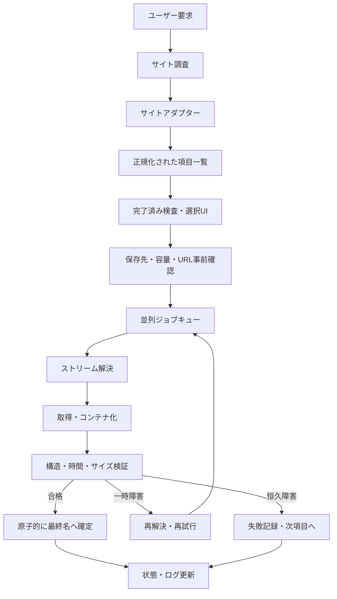

# 汎用・大量メディアダウンロードCLI 設計・実装ナレッジ

## 0. この文書の目的

この文書は、ユーザーが指定したWebサイトから、許可された動画・音声などのメディアを多数取得し、長時間でも安全に完走できる対話型CLIを設計・実装するためのナレッジ兼設計書である。

主な読者は、次回以降に同種のCLIを実装・改修するAIおよび開発者である。最初から最後まで読めば、特定サイトのDOMやAPIを別サイトへ誤って流用せず、対象サイトを調査したうえで、そのサイト専用のアダプターと汎用ダウンロードエンジンを構築できることを目標とする。

この文書には次の2種類の情報がある。

- **汎用設計**: サイトに依存せず再利用すべき安全性、状態管理、進捗表示、再試行、検証、テストの設計
- **実例**: 2026年のインハイTV・バドミントン配信に対して実際に調査・実装した際の構造、障害、改善結果

インハイTVの実例は、あくまで実装方法を理解するためのケーススタディである。別サイトに対し、URL、API、DOM、日付、コート番号、メディアID形式、配信事業者、HLS構造などをコピーしてはならない。

### 0.1 AIへ渡す最小コンテキスト

この文書だけでは対象サイトや保存先を決定できない。AIが一貫して作業するには、次のセットを渡す。

1. この設計書
2. 第27章の入力済み実装依頼テンプレート
3. 対象サイトへアクセスできる環境
4. 作業対象リポジトリまたは新規作成先
5. 保存先を検査できるPC環境
6. 認証が必要な場合は、ユーザーが許可した正式な認証経路

不足情報が読み取り調査で判明しない場合は、第3.2章の停止条件に従う。この文書の目的は、未知情報を推測させることではなく、調査・判断・実装・検証・実行の順序を一意にすることである。

---

## 1. AIが最初に守るべき指示

将来この文書を読み込むAIは、実装前に必ず以下を守ること。

1. **対象サイトの構造を推測で決めない。** ブラウザー画面、ネットワーク通信、HTML、埋め込みJSON、公開APIなどを実際に調査する。
2. **サイト固有処理と汎用処理を分離する。** サイト変更の影響をアダプター内部に閉じ込める。
3. **ユーザーが取得を許可されているコンテンツだけを対象にする。** 利用規約、著作権、契約、アクセス権を尊重する。
4. **DRM、アクセス制御、認証、課金を回避しない。** DRM保護を検出した場合は非対応として停止し、理由を明示する。
5. **ユーザーが指定した保存ポリシーを厳守する。** 「外付けHDDのみ」と指定された場合、内蔵ストレージへ動画、一時ファイル、キャッシュ、ログ、状態ファイルをフォールバック保存しない。
6. **大量取得前に読み取り専用の事前確認を行う。** 件数、対象、URL解決可否、推定時間、推定容量、保存先、安全性を検証する。
7. **中断・再実行が安全な冪等設計にする。** 完了済みは再取得せず、不完全ファイルは検証して再利用または再取得する。
8. **1件の失敗や停止で全体キューを永久停止させない。** タイムアウト、再試行、失敗記録、次項目への継続を設計する。
9. **進捗画面を固定領域で更新する。** 同じ進捗行を延々と標準出力へ追記しない。
10. **安定稼働中の本番スクリプトを無断で直接変更しない。** 新版は別ブランチ、別ファイル、または明示的なバージョンとして検証する。
11. **検証できていない事実を断定しない。** サイト上の件数やAPI仕様は変化するため、取得日時を添えたスナップショットとして扱う。
12. **「最高画質」と「再エンコード」を混同しない。** 原則として配信元の最高品質ストリームを選び、映像・音声を再エンコードせずコンテナへ保存する。
13. **AIに許可された実行段階を越えない。** 実装だけ、代表項目の試験まで、選択全件の完了までを明示的に区別する。
14. **誰が実行しても同じ環境を再構築できるようにする。** 対応OS、ランタイム、依存関係、導入方法、起動前診断を成果物へ含める。
15. **同じ保存先への二重起動を防ぐ。** 実行ロックを取得できない場合、ダウンロードを開始しない。
16. **CLIの入力、設定優先順位、終了コードを契約として固定する。** 実装者ごとに意味を変えない。
17. **認証情報を秘密として扱う。** 必要最小限だけメモリーへ読み、ログ、状態、Git、コマンド履歴へ漏らさない。
18. **配信形式の対応可否を先に判定する。** 未実装の構成を無理に処理せず、非対応理由を明示する。

---

## 2. 適用範囲と非目標

### 2.1 適用する場面

- 1つの大会に複数日・複数会場・複数コートのアーカイブがある
- 複数講義、複数セッション、複数カメラなどをまとめて保存したい
- 数時間のメディアが数十〜数百件あり、手作業では現実的でない
- HLS、DASH、直接MP4などを元の品質を保って保存したい
- 長時間処理を就寝中などに実行し、途中障害から復旧したい
- 選択UI、進捗率、残り時間、終了予定時刻、完了確認が必要

### 2.2 非目標

- DRMの解除
- 認証や有料アクセスの迂回
- サイトへの過剰アクセスやレート制限の回避
- 元配信に存在しない高画質化
- 著作権者・配信者が許可していない再配布
- すべてのサイトへ無調査で対応する万能スクレイパー

「汎用CLI」とは、どのサイトにも同じ解析ロジックを押し付けることではない。**共通エンジンを再利用し、サイトごとの調査結果をアダプターとして実装できる構造**を意味する。

---

## 3. 要件を確定するための入力契約

AIは、実装前に以下の情報をユーザー要求、対象サイト、ローカル環境から確定する。読み取り調査で判明する事項を、ユーザーへ何度も質問して負担をかけないこと。一方、保存先や権利など、推測すると危険な事項は確認する。

| 分類 | 確認項目 | 例 | 確定方法 |
|---|---|---|---|
| 対象 | 起点URL | 大会一覧、チャンネル、講義一覧 | ユーザー指定 |
| 範囲 | 日付、カテゴリ、会場、コート、ID | 7月23〜27日 | ユーザー指定＋サイト調査 |
| 取得権限 | 閲覧・保存が許可されているか | 公開アーカイブ | ユーザー確認＋利用条件 |
| 認証 | ログイン、Cookie、トークン | ブラウザーセッション | サイト調査 |
| 品質 | 最高、上限1080p、音声言語 | 1080p以下の最高 | ユーザー指定 |
| 保存先 | 外付け限定か、任意か | `/Volumes/...` | ユーザー指定＋OS検証 |
| 命名 | ファイル名、フォルダー階層 | `日付_コート番号.mp4` | ユーザー指定 |
| 選択UI | 全件、複数選択、フィルター | `j/k`＋Space | ユーザー指定 |
| 並列度 | 回線、配信元、ディスクの許容 | 2並列 | 実測＋保守的既定値 |
| 完了条件 | 構造、長さ、件数 | ffprobe検証済み | 設計で定義 |
| 中断 | Ctrl+C、再開方式 | 完了済みスキップ | 設計で定義 |
| 実行権限 | AIがどこまで実行してよいか | 実装のみ / 代表試験 / 全件完了 | ユーザー指定 |
| 実行環境 | OS、CPU、Python、FFmpeg | macOS、Python 3.x | ローカル調査＋設計で固定 |
| 設定方法 | CLI、設定ファイル、環境変数 | CLIを最優先 | 設計で定義 |
| 終了結果 | 成功、部分失敗、中断 | exit codeとsummary | 設計で定義 |
| 多重起動 | 同じ保存先を共有するか | 共有禁止 | 設計で定義 |

### 3.1 最初に出すべき調査結果

大量ダウンロードを開始する前に、少なくとも次を表示する。

- 対象サイトと起点URL
- 調査で見つけた分類軸と各値
- 選択対象の件数および項目一覧
- 解決可能、取得不能、要認証、DRMなどの内訳
- 合計再生時間と推定容量
- 保存先の物理・論理情報と空き容量
- 出力ファイル名の例
- 並列度と品質選択
- 中断・再実行時の動作
- 事前確認時刻と、情報がスナップショットである旨
- AIに許可された実行段階
- 実行環境診断の結果と依存ツールのバージョン
- 認証の要否、保存方法、有効期限。ただし秘密値そのものは表示しない

### 3.2 AIが停止して確認すべき条件

次は推測で進めると結果または権限が変わるため、読み取り調査で確定できなければユーザーへ確認する。

- 起点URLまたは取得対象が特定できない
- 取得権限・利用条件を確認できない
- 保存先ポリシーが不明、または指定保存先が複数候補になる
- 認証情報の取得方法に追加権限が必要
- CAPTCHA、MFA、DRM、課金、アクセス制御に遭遇した
- MP4へstream copyできず、別コンテナまたは再エンコードが必要
- 既存ファイルとの衝突や旧フォルダー移行で上書き・削除が発生する
- 依存ソフトのインストールが必要で、環境変更の許可がない
- AIが代表試験または全件取得を実行してよいか未確定
- サイト側へ高負荷を与える並列度や大量リクエストが必要

次は、ユーザー要求と矛盾しなければ保守的既定値で進め、最終報告で明示できる。

- 並列度は2から開始
- 再エンコードしない
- 完成済み正常ファイルは除外
- ASCII中心の出力フォルダー名
- `faststart`はローカル保存用途では既定無効
- 再試行は少数回かつbackoff付き
- 未対応項目は上書きや迂回をせず理由付きで除外

---

## 4. 完了条件

「コマンドが起動した」だけでは完成ではない。次をすべて満たして初めて、実装が完了したと判断する。

- 対象サイトから項目一覧を動的に取得できる
- 選択対象と除外対象が明示される
- 完了済みの正常なファイルは選択肢から除外される
- 保存先ポリシーに違反しない
- 配信元に存在する指定品質のストリームを選べる
- 進捗表示が固定領域で更新され、標準出力が増殖しない
- 項目別進捗、全体進捗、残り時間、終了予定時刻が表示される
- 一定時間進捗しないジョブを検知し、終了・再試行・次項目へ移行できる
- Ctrl+Cを1回押せば、破損リスクを抑えて有限時間内に終了処理へ入る
- 再実行で完了済みを重複取得しない
- 最終MP4をffprobe等で検証する
- 一時ファイルから最終ファイルへの切り替えが同一ファイルシステム上で原子的に行われる
- 読み取り専用チェック、単体テスト、疑似障害テスト、少数の実サイト試験に合格する
- 本番スクリプトのバージョンとハッシュを記録できる
- `--doctor`相当の診断で、OS、依存関係、保存先、端末要件を確認できる
- CLIオプション、設定優先順位、終了コードが文書と実装で一致する
- 同じ保存先への二重起動が安全に拒否される
- 認証が必要な場合、取得、利用、更新、破棄が安全に行われる
- 対応外の配信構成を誤取得せず、理由付きで判定できる
- 許可された実行段階の完了基準を満たし、最終サマリーが出力される

---

## 5. 推奨アーキテクチャ

### 5.1 コアエンジンとサイトアダプター

次の2層へ明確に分ける。

#### コアエンジン

サイトに依存しない処理を担当する。

- CLI引数とヘルプ
- 対話型選択UI
- 保存先検証
- 完了済みスキャン
- 容量見積もり
- 並列実行キュー
- FFmpegなどの子プロセス管理
- 進捗、ETA、終了予定時刻
- ストール監視と再試行
- Ctrl+Cと終了処理
- 結果検証と原子的確定
- ログ、状態、再開

#### サイトアダプター

対象サイトに固有の処理を担当する。

- 一覧の発見
- ページネーション
- サイト固有IDの抽出と検証
- 表示名、分類軸、並び順
- 再生URLやマニフェストURLの解決
- Cookie、Referer、User-Agentなど必要ヘッダー
- 署名付きURLの期限切れ時の再解決
- 品質候補の取得
- サイト固有エラーの分類



### 5.2 推奨モジュール構成

単一ファイルでも実装可能だが、今後複数サイトへ対応するなら以下を推奨する。

```text
bulk-media-cli/
├── cli.py
├── core/
│   ├── models.py
│   ├── config.py
│   ├── doctor.py
│   ├── auth.py
│   ├── storage.py
│   ├── locking.py
│   ├── inventory.py
│   ├── selector.py
│   ├── resolver.py
│   ├── downloader.py
│   ├── progress.py
│   ├── verifier.py
│   ├── state.py
│   └── signals.py
├── adapters/
│   ├── base.py
│   └── target_site.py
├── tests/
│   ├── fixtures/
│   ├── test_adapter.py
│   ├── test_storage.py
│   ├── test_progress.py
│   ├── test_retry.py
│   └── test_signals.py
└── docs/
    └── target-site-notes.md
```

小規模な配布用 `.command` にまとめる場合でも、内部のクラスと関数は同じ責務分離を維持する。

### 5.3 再現可能な実行環境と配布

AIが自分の開発セッション内で一度動かせただけでは完成としない。別のターミナル、新しいシェル、再起動後でも同じ手順で起動できることを確認する。

#### 実行環境マニフェスト

プロジェクトごとに、少なくとも次をREADMEまたは専用ファイルへ固定する。

```yaml
runtime:
  supported_os:
    - name: macOS
      minimum_version: "<検証済み下限>"
      architectures: [arm64, x86_64]
  python:
    minimum: "<検証済みバージョン>"
    maximum_exclusive: "<未検証の次期バージョン>"
  external_tools:
    ffmpeg: "<検証済み範囲>"
    ffprobe: "<検証済み範囲>"
  dependencies:
    policy: "標準ライブラリ優先。外部依存はロックする"
```

値はテンプレートのまま配布せず、実機テストで確定する。PythonやFFmpegの「最新版なら動く」と推測しない。開発時に使ったバージョン、最小対応版、未検証範囲を分けて記載する。

#### 依存関係

- Python外部パッケージを使う場合、`pyproject.toml`とロックファイル等でバージョンを固定する
- ハッシュ固定に対応する環境では、供給元改ざんリスクを下げるため利用する
- 標準ライブラリだけで実装した場合も、その事実とPython対応範囲を明記する
- FFmpegとffprobeは同じ配布元・同じバージョン系列を推奨する
- `ffmpeg -version`、`ffprobe -version`、必要オプションの存在を起動前に検査する
- パッケージ導入コマンドはOSごとに分け、存在しないパッケージマネージャーを自動実行しない
- インストールはユーザー環境を無断で変更せず、必要なら確認を取る

#### `.command`ランチャー

macOS向けに`.command`を配布する場合:

- カレントディレクトリではなく、ランチャー自身の絶対位置を基準に本体を起動する
- パスの空白、日本語、記号を正しく引用する
- `chmod +x`が必要であることをREADMEへ記載する
- 実行ランタイムが見つからない場合、黙って別のPythonを使わず診断を表示する
- launcherと本体のバージョン不一致を検出する
- Finder起動とターミナル起動の両方を試験する
- 終了時に結果を読めるようにする一方、常に無限入力待ちにはしない

#### `--doctor`

`--doctor`は本体を取得せず、以下を検査して項目ごとに`OK / WARN / ERROR`を表示する。

```text
[OK] OSとCPUアーキテクチャ
[OK] Python 3.x.x（検証済み範囲内）
[OK] ffmpeg / ffprobe（必要オプションあり）
[OK] DNS・HTTPS・システム時刻
[OK] 対象サイトへの最小接続
[OK] 端末が対話UIに対応
[OK] 保存先の種別、同一性、書込可否、空き容量
[OK] 同じ保存先を利用中の別プロセスなし
[WARN] 認証の有効期限を取得できない
```

`--doctor`は動画、状態、ログを作らない読み取り中心の診断を基本とする。書込可否検査が必要な場合だけ、対象保存先に小さな診断ファイルを作成・同期・削除し、その事実を表示する。削除できなかった場合はパスを明示する。

---

## 6. 正規化データモデル

### 6.1 「日付・コート」を固定スキーマにしない

サイトによって分類軸は異なる。

- スポーツ配信: 日付、大会、種目、性別、コート
- 講義: 学期、科目、回、講師
- カンファレンス: 日、トラック、セッション
- 監視カメラ: 拠点、カメラ、時間帯

したがって、コア側は任意の分類軸を保持できるようにする。

```python
@dataclass(frozen=True)
class MediaItem:
    adapter: str
    stable_id: str
    title: str
    source_page_url: str
    dimensions: dict[str, str]   # 例: {"date": "2026-07-23", "court": "01"}
    sort_key: tuple
    suggested_stem: str
    expected_media_id: str | None = None
    metadata: dict[str, object] = field(default_factory=dict)
```

`stable_id`は表示名ではなく、サイト内で同一項目を識別できる値にする。適切なサイトIDがなければ、正規化URLと分類値からハッシュを作る。その際も、URL内の短期署名や追跡クエリは除去する。

### 6.2 解決済みストリーム

```python
@dataclass(frozen=True)
class StreamCandidate:
    url: str
    protocol: Literal["file", "hls", "dash", "direct"]
    width: int | None
    height: int | None
    bitrate: int | None
    video_codec: str | None
    audio_codec: str | None
    headers: dict[str, str]
    expires_at: datetime | None

@dataclass(frozen=True)
class ResolvedMedia:
    item: MediaItem
    candidates: tuple[StreamCandidate, ...]
    expected_duration_seconds: float | None
    duration_source: str
    is_live: bool
    has_drm: bool
    resolved_at: datetime
```

### 6.3 実行権限、認証、対応能力

実装時の曖昧さをなくすため、実行権限とアダプター能力もデータとして保持する。

```python
class ExecutionLevel(Enum):
    BUILD_ONLY = "build-only"
    SMOKE_TEST = "smoke-test"
    FULL_RUN = "full-run"

@dataclass(frozen=True)
class AuthContext:
    method: Literal["none", "browser-session", "api-token", "oauth", "other"]
    secret_reference: str | None   # 秘密値ではなくKeychain名や環境変数名
    expires_at: datetime | None
    refresh_supported: bool

@dataclass(frozen=True)
class AdapterCapabilities:
    protocols: frozenset[str]
    supports_vod: bool
    supports_live: bool
    supports_resume: bool
    supports_multiple_audio: bool
    supports_subtitles: bool
    supports_discontinuity: bool
    supports_encrypted_hls: bool
    supports_drm: bool = False
```

`supports_drm`は原則`False`である。DRMを検出した場合に処理を続けるためのフラグとして使ってはならず、能力判定で明示的に拒否するために使う。

### 6.4 実行結果

```python
@dataclass
class DownloadResult:
    stable_id: str
    status: Literal[
        "completed", "skipped", "failed", "cancelled", "unsupported"
    ]
    final_path: Path | None
    bytes_written: int
    duration_seconds: float | None
    attempts: int
    error_code: str | None
    error_message: str | None
```

### 6.5 アダプター契約

```python
class SiteAdapter(Protocol):
    name: str
    capabilities: AdapterCapabilities

    def probe(self, start_url: str) -> ProbeResult:
        """サイト対応可否と認証・利用条件上の前提を確認する。"""

    def discover(self, start_url: str) -> list[MediaItem]:
        """ページネーションを含め、対象候補を列挙する。"""

    def resolve(self, item: MediaItem) -> ResolvedMedia:
        """実行直前に再生ストリームと品質候補を解決する。"""

    def refresh(self, item: MediaItem, previous: ResolvedMedia) -> ResolvedMedia:
        """署名期限切れなど一時障害後に再解決する。"""

    def classify_error(self, error: Exception | ProcessResult) -> ErrorDecision:
        """再試行、恒久失敗、認証要求、非対応を分類する。"""
```

コアエンジンは、サイト固有APIレスポンスを直接参照してはならない。アダプターが正規化した型だけを受け取る。

---

## 7. 対象サイトの調査手順

### 7.1 調査は実際のユーザー導線から始める

1. 起点URLを開く。
2. ユーザーが説明した手順を再現する。
3. 一覧、日付切替、カテゴリ切替、再生ボタンを操作する。
4. 画面に存在する件数と項目名を記録する。
5. ブラウザー開発者ツールで、操作ごとに発生する通信を確認する。
6. HTMLまたはJavaScriptに埋め込まれた初期状態を確認する。
7. 再生プレイヤーが取得するマニフェストやメタデータを確認する。
8. 同じ情報を安定して取得できる最小の公開インターフェースを選ぶ。

### 7.2 情報源の優先順位

原則として次の順に選ぶ。

1. サイトが公開している正式なAPIやフィード
2. ブラウザー自身が利用している読み取りAPI
3. HTML内の構造化データや埋め込みJSON
4. 安定したHTML要素の解析
5. ブラウザー自動操作

ブラウザー自動操作は、表示変更やタイミングに弱く、長時間バッチの信頼性を落とす。認証操作やJavaScript実行が必須の場合に限り、一覧発見またはセッション取得へ限定することが望ましい。

### 7.3 必ず確認する通信特性

- GET/POST、パラメーター、JSONスキーマ
- ページ番号、カーソル、無限スクロール
- Cookie、Authorization、CSRF、Referer、Origin
- User-Agent制約
- レート制限、429、Retry-After
- 署名付きURLと有効期限
- IDの形式と長さ
- 日時のタイムゾーン
- 取得不能項目が一覧に混在するか
- 再生URLが項目ごとに固定か、毎回発行か
- HLSマスターかメディアプレイリストか
- VODかライブ追記中か
- DRM情報が存在するか

### 7.4 調査証跡

サイトアダプターごとに、以下をMarkdownへ残す。

```text
- 調査日時とタイムゾーン
- 起点URL
- ユーザー操作手順
- 一覧取得方法
- ページネーション方式
- 再生URL解決方法
- 必要ヘッダーまたは認証
- ID形式
- 品質選択方式
- 時間取得方式
- DRMの有無
- 既知の取得不能項目
- サンプルレスポンスの匿名化fixture
- サイト変更を検出する条件
```

機密Cookie、トークン、署名URLは文書やGitへ保存しない。

### 7.5 認証ライフサイクル

認証が必要なサイトでは、単に「Cookieを渡す」とだけ実装してはならない。取得、保管、利用、更新、失効、削除までを設計する。

#### 認証方法の優先順位

1. サイトが提供する正式なAPIトークンまたはOAuth
2. ユーザーが明示的に許可した既存ブラウザーセッション
3. CLI内の対話ログイン。ただしサイトが許可し、MFAやCAPTCHAを迂回しない場合
4. その他の正式な方法

ブラウザープロファイルやCookieデータベースを、ユーザーの明示許可なしに探索・複製しない。MFA、CAPTCHA、デバイス認証を回避しない。

#### 秘密情報の保管

- 可能ならOS Keychain等へ保存し、状態ファイルには参照名だけを置く
- 環境変数を使う場合、プロセス一覧やシェル履歴への露出を確認する
- 平文設定ファイルが不可避なら、保存場所を明示し、所有者だけが読める権限にする
- Cookie、Authorization、署名クエリをログへ出す前にマスクする
- fixture、エラーレポート、スクリーンショットにも秘密値を残さない
- 完了後に不要な一時認証ファイルを安全に削除する

#### 有効性と更新

```text
起動前:
  認証の存在 -> 最小APIで有効性確認 -> 有効期限を可能なら取得

実行中:
  401/403 -> URL期限切れかセッション失効か分類
           -> 許可されたrefreshを1回実行
           -> 更新成功なら待機ジョブへ新しいAuthContextを共有
           -> 更新不能なら新規ジョブを止め、安全に全体停止

終了時:
  メモリー上の参照を破棄 -> 一時ファイルを削除 -> 秘密を含まない結果だけ記録
```

複数ワーカーが同時に認証更新しないよう、更新処理を単一ロックで直列化する。更新後の秘密を既に起動中のFFmpegへ安全に差し替えられない場合、その試行を停止して新しいURL・ヘッダーで再起動する。

#### 認証に関する停止条件

- ユーザー許可のないCookie取得が必要
- CAPTCHAやMFAの迂回が必要
- 認証情報を安全に保持できない
- 利用条件上、自動取得が許可されない
- 同一資格情報で想定外の権限範囲が返る

これらの場合は実装を強行せず、何が必要かをユーザーへ報告する。

---

## 8. 配信方式別の処理

| 方式 | 発見対象 | 推奨処理 | 注意点 |
|---|---|---|---|
| 直接MP4/WebM | メディアURL | HTTP再開対応で取得 | Content-Length、Range、期限切れ |
| HLS | `.m3u8` | 品質選択後、FFmpeg等でストリームコピー | マスター/メディア、暗号化、ENDLIST |
| MPEG-DASH | `.mpd` | 映像・音声表現を選択し結合 | 別トラック、DRM、SegmentTemplate |
| 外部動画サービス | 埋め込みID | 公式に許可された方法・対応ツール | サービス規約、認証 |
| `blob:` URL | プレイヤー通信 | `blob:`自体でなく元マニフェストを調査 | ブラウザー内一時URL |
| DRM付きHLS/DASH | DRM記述 | 非対応として停止 | 回避実装をしない |

### 8.1 HLS

- マスタープレイリストの`#EXT-X-STREAM-INF`を解析する。
- 解像度だけでなく、帯域幅、コーデック、フレームレート、音声グループも記録する。
- 相対URLはプレイリストURLを基準に安全に解決する。
- `#EXT-X-ENDLIST`があるVODなら、全`#EXTINF`の合計を正確な予定時間として利用できる。
- ライブまたはイベント形式で追記中なら、事前の合計時間を確定値として扱わない。
- AES-128など標準HLS暗号化で、ユーザーが正当に閲覧でき、プレイヤーが通常取得する鍵をFFmpegが標準処理できる場合でも、サイト条件を確認する。
- Widevine、FairPlay、PlayReady等のDRMがある場合は停止する。

### 8.2 DASH

- MPDの期間、AdaptationSet、Representationを解析する。
- 映像と音声が別の場合、品質ポリシーに沿って組み合わせる。
- `ContentProtection`を検査し、DRMがあれば非対応とする。
- SegmentTimelineまたは期間情報から予定時間を計算する。

### 8.3 直接ファイル

- `HEAD`が拒否されるサイトもあるため、必要なら小さなRange GETで検証する。
- ETag、Last-Modified、Content-Lengthを状態へ記録し、再開時に同一ファイルか確認する。
- Range非対応の場合、中途ファイルの単純追記をしない。

### 8.4 対応能力の事前判定

ストリームを見つけた後、ダウンロード開始前にアダプターの`AdapterCapabilities`と実ストリームの特徴を比較する。未対応の特徴が1つでもあれば、対象項目を`unsupported`として理由を表示する。

| 特徴 | 検査方法の例 | 対応方針を決める事項 |
|---|---|---|
| HLS MPEG-TS | セグメント拡張子・probe | MP4へstream copy可能か |
| HLS fMP4 | `EXT-X-MAP` | init segmentを含め正しくmuxできるか |
| discontinuity | `EXT-X-DISCONTINUITY` | タイムスタンプ不連続を試験済みか |
| 複数音声 | AUDIO media groups | 全音声か指定言語か |
| 字幕 | SUBTITLES media groups | 保存、別ファイル、除外のどれか |
| 暗号化HLS | `EXT-X-KEY` | 標準対応可能か、DRMか |
| key rotation | 複数のKEY | 利用条件とツール対応を確認したか |
| ライブ/追記中 | ENDLISTなし | 待機、指定時間取得、非対応のどれか |
| DASH複数Period | MPDのPeriod | 連結を検証済みか |
| DASH別音声 | AdaptationSet | 映像・音声の組合せを決めたか |
| DRM | ContentProtection等 | 常に停止 |
| コーデックとMP4非互換 | codec情報とffprobe | 別コンテナか、明示的変換か |

#### ライブまたは未確定アーカイブ

大量アーカイブ保存CLIの既定動作は、完成済みVODだけを対象にする。ライブまたは更新中のプレイリストを検出した場合、次のいずれかをユーザー要件として明示する。

- 公開完了まで待ってから開始する
- 指定終了時刻まで録画する
- 今回は対象外として一覧に残す

VODと誤認して途中までを完成ファイルにしない。ライブ対応を実装する場合、予定時間、再開、終了条件、プレイリスト更新間隔はVODとは別の状態機械にする。

#### コンテナ決定

ユーザーがMP4を希望していても、元コーデックがMP4へ安全にstream copyできない場合がある。次の優先順位で処理する。

1. 元品質を維持できる互換コンテナへ変更してよいか確認する
2. 再エンコードを許可するか、品質・時間・CPU負荷を説明して確認する
3. どちらも許可されなければ非対応として停止する

拡張子だけを`.mp4`へ変更してはならない。

---

## 9. 一覧の正規化、重複、命名

### 9.1 一意性

同じ動画が複数の日付タブやカテゴリに現れる場合がある。重複判定は次の優先順位にする。

1. サイトの不変メディアID
2. 正規化された再生項目ID
3. 正規化URL＋主要分類値のハッシュ

タイトル文字列だけで同一判定しない。

### 9.2 動的な分類軸

選択画面は、`dimensions`に存在する軸を動的に表示する。インハイTVなら日付とコート、別サイトなら講義名と回数になる。CLIの内部ロジックに`date`や`court`を必須として埋め込まない。

### 9.3 安全なファイル名

既定はASCII中心の移植可能な名前を推奨する。

- 使用候補: `A-Z a-z 0-9 . _ -`
- `/`、NUL、制御文字、OS予約文字を除去する
- 先頭末尾の空白・ドットを避ける
- 長すぎるタイトルは短縮し、末尾へ安定IDの短いハッシュを付ける
- 大文字小文字を区別しないファイルシステムでの衝突を検査する
- Unicodeを使う場合は正規化方式を決める
- 同じ名前が生じた場合、黙って上書きせず、分類値またはIDを付加する

例:

```text
2026-07-23_01.mp4
2026-07-23_01__a1b2c3d4.mp4   # 衝突時
```

外付けボリューム自体のラベルに日本語が含まれることと、アプリが作る出力フォルダー名は分けて考える。ボリュームラベルはユーザー管理だが、アプリ作成フォルダーはASCII名を既定にすると、シェル、他OS、古いツールとの互換性が高い。

### 9.4 パストラバーサル対策

すべての出力パスを保存ルート配下へ閉じ込める。

```python
def safe_child(root: Path, name: str) -> Path:
    root_real = root.resolve(strict=True)
    candidate = (root_real / name).resolve(strict=False)
    if candidate.parent != root_real:
        raise UnsafePathError(name)
    return candidate
```

実装ではサブフォルダーを許す場合も、`candidate`が`root_real`配下であることを`relative_to`等で厳密に確認する。シンボリックリンクによる保存先逸脱も防ぐ。

### 9.5 信頼できないURL・ヘッダー・メタデータ

対象サイトのレスポンス、タイトル、マニフェスト、URLはすべて信頼できない入力として扱う。

#### 子プロセス

- URLやファイル名を含むコマンド文字列を組み立ててシェルへ渡さない
- `subprocess.Popen([...], shell=False)`のように引数配列を使う
- URLが`-`で始まる等、オプションとして解釈されない位置と区切りを確認する
- ヘッダー値のCR/LFを拒否し、ヘッダーインジェクションを防ぐ
- stderrに出た署名URLやAuthorizationをログ保存前にマスクする

#### ネットワーク

- 起点URLは既定で`https`、必要な場合だけ`http`を許可する
- `file:`, `data:`, `javascript:`等をメディアURLとしてFFmpegへ渡さない
- リダイレクト回数に上限を設け、最終hostとschemeを記録する
- HLS/DASH内の参照先hostが想定範囲か確認する。CDNの別hostは調査証跡へ登録する
- TLS証明書検証を無効化しない
- API、HTML、マニフェストの最大レスポンスサイズを設ける
- 圧縮レスポンスの展開後サイズを無制限にしない
- connect/read/total timeoutを分ける
- ローカルhost、リンクローカル、プライベートネットワークへの予期しないリダイレクトを拒否する

#### FFmpegプロトコル

FFmpegは入力から別プロトコルを参照できる場合がある。必要最小限のprotocol whitelistを検討し、マニフェスト経由でローカルファイルや意図しないネットワーク資源へアクセスさせない。利用するFFmpeg版でオプションの有効性をテストする。

#### 表示とログ

- タイトル内のANSI escapeと制御文字を除去してから端末へ表示する
- JSON出力では正しいエスケープを行う
- ログへ保存するURLは署名クエリを除去またはマスクする
- サイト由来の文字列をログ書式やファイルパスとして直接使わない

---

## 10. 保存先の安全設計

### 10.1 保存ポリシーを型として扱う

```python
@dataclass(frozen=True)
class StoragePolicy:
    root: Path
    external_only: bool
    allow_network_volume: bool
    minimum_free_bytes: int
    reserve_ratio: float
    allow_internal_fallback: bool = False
```

`external_only=True`なら、保存先が見つからない場合はエラーで停止する。内蔵ストレージの一時ディレクトリへ自動退避してはならない。

### 10.2 macOSで確認する事項

- `/Volumes`配下であることだけでは外付けの証明にならない
- `diskutil info -plist`等でデバイス、内部/外部、リムーバブル、物理ストアを確認する
- APFSコンテナやネットワークボリュームでは判定項目が異なるため、単一文字列だけに依存しない
- 書き込み可能か、小さな一時ファイルを対象ボリューム内で作成・同期・削除して確認する
- 実行中もマウント先のデバイス同一性を確認し、別ボリュームへすり替わった場合は停止する

「マウントされている」「空き容量が読める」ことは、HDDの物理的健全性を保証しない。SMART、USB接続、ケーブル、電源、ファイルシステムの状態は別の検査対象である。

### 10.3 保存先に置くもの

外付け限定なら、次をすべて外付け側へ置く。

```text
<target>/
├── 2026-07-23_01.mp4
├── 2026-07-23_02.mp4
└── .bulk-media-download/
    ├── state.json
    ├── manifest.json
    ├── logs/
    │   ├── run-20260728T010000+0900.log
    │   └── item-<stable-id>.log
    └── partial/
        └── <stable-id>.part.mp4
```

Python、FFmpeg、OSが暗黙に使うキャッシュ場所も確認する。明示できない外部ライブラリを利用する場合、内部ディスクへ大容量キャッシュを作らないことを試験する。

### 10.4 容量計算

最低限、次のように計算する。

```text
expected_bytes = sum(各項目の推定ビットレート × 予定秒数 ÷ 8)
required_bytes = expected_bytes × safety_ratio + fixed_reserve
```

推奨初期値の例:

- `safety_ratio`: 1.15〜1.25
- `fixed_reserve`: 状態・ログ・誤差分として数GB

ただし、品質ごとの帯域幅値が実態より大きい/小さいことがある。実測済み項目の平均バイト/秒が得られたら、同種ストリームの見積もりを更新する。

### 10.5 原子的確定

1. 保存先と同じファイルシステム内の一時パスへ書く。
2. FFmpeg終了コードを確認する。
3. ffprobe等で一時ファイルを検証する。
4. ファイルをflushし、必要に応じてfsyncする。
5. 同名の正常完成ファイルがないことを再確認する。
6. `os.replace`等で最終名へ切り替える。
7. 状態ファイルを原子的に更新する。

異なるファイルシステムをまたぐrenameは原子的でないため、一時ファイルを内蔵ストレージへ置かない。

### 10.6 旧フォルダー移行

- 旧名と新名の両方にファイルがある場合、自動マージしない
- ファイルごとに検証し、衝突を一覧表示する
- 移動前後の件数、サイズ、安定IDを照合する
- ユーザーの明示確認なしに削除しない
- 移行を行うならログとロールバック方法を残す

### 10.7 実行中の保存先監視

起動前確認だけでは、数時間後の容量不足や切断を防げない。以下のタイミングで保存先を再検査する。

- 新しいジョブを開始する直前
- 一定時間ごと、または一定GB書き込むごと
- 書込エラーや異常な進捗停止を検出したとき
- 再試行を開始する前
- 最終ファイルへ確定する前

確認項目:

- マウント先とデバイス識別子が起動時と同じ
- 出力ルートが通常ディレクトリであり、symlinkへ変化していない
- 書き込み可能
- 現在空き容量が「実行中一時ファイルの残量＋待機項目の安全余裕」を満たす
- ファイルシステムがread-onlyへ変化していない

容量が安全下限を割った場合、新しいジョブを開始せず、実行中ジョブを安全に停止できるか判断する。別のボリュームや内蔵ディスクへ自動で切り替えない。

---

## 11. 状態管理と冪等性

### 11.1 状態ファイル例

```json
{
  "schema_version": 1,
  "adapter": "target-site-v1",
  "source_url": "https://example.invalid/collection/123",
  "created_at": "2026-07-28T01:00:00+09:00",
  "storage_identity": {
    "mount": "/Volumes/EXTERNAL",
    "device": "disk4s2",
    "volume_uuid": "..."
  },
  "items": {
    "stable-item-id": {
      "status": "completed",
      "final_name": "2026-07-23_01.mp4",
      "size_bytes": 8500000000,
      "duration_seconds": 12954.903,
      "verified_at": "2026-07-28T02:10:00+09:00",
      "attempts": 1,
      "source_fingerprint": "..."
    }
  }
}
```

### 11.2 状態ファイルだけを信用しない

起動時に次を照合する。

- 最終ファイルが存在するか
- 通常ファイルであり、シンボリックリンクでないか
- サイズが妥当か
- ffprobeでコンテナと映像ストリームを読めるか
- 記録時間と実ファイル時間が許容差内か
- 必要ならsource fingerprintが同じか

状態が`completed`でもファイルが壊れていれば完了扱いしない。反対に、状態更新前に終了したが正常な最終ファイルがある場合は、検証して完了状態を再構築する。

### 11.3 一時ファイルの扱い

- 構造的に正常で予定時間に達している一時MP4は、検証後に救済できる
- `moov atom not found`など構造不正なら完成扱いにしない
- HLSを単一MP4へ直接書く方式では、単純なバイト位置からの再開が困難な場合がある
- 再開可能性を重視するなら、セグメント単位キャッシュ＋後段結合を別設計として検討する
- ただしセグメントキャッシュはファイル数、容量、実装複雑性が増える

### 11.4 状態の原子的更新

`state.json.tmp`へ書き、flush/fsync後に`state.json`へreplaceする。途中終了でJSONが半端にならないようにする。直前世代のバックアップを1つ保持してもよい。

### 11.5 二重起動ロック

同じ保存ルートに対して、書込みを伴う実行は同時に1つだけ許可する。`--check-only`も、完成ファイルを検証中の本番プロセスと競合する可能性があるため、既定では共有ロックまたは読み取り専用の安全な方式を使う。

ロックファイル例:

```json
{
  "schema_version": 1,
  "run_id": "<uuid>",
  "pid": 12345,
  "host": "mac-name",
  "started_at": "2026-07-28T01:00:00+09:00",
  "process_start_identity": "<PID再利用を区別する値>",
  "script_sha256": "<hash>",
  "output_root": "/Volumes/EXTERNAL/bulk-media"
}
```

#### ロック取得

- OSの排他的ファイルロック、または原子的な`O_CREAT | O_EXCL`を使う
- 「ファイルが存在しなかった」という事前確認と作成を別操作にしない
- 取得後に保存先デバイス同一性を再確認する
- ロック取得失敗時は、既存run ID、PID、開始時刻を表示して終了する
- `--force`だけで無条件削除しない

#### stale lockの回収

次をすべて確認してから回収する。

1. 同じhostでPIDが存在しない、またはprocess start identityが一致しない
2. 対応する子プロセスが存在しない
3. 一時ファイルのサイズ・mtimeが一定確認期間変化していない
4. 状態ファイルのrun IDと整合する
5. ユーザーへ回収対象と根拠を表示する

ネットワークボリュームではファイルロックの意味が異なる場合があるため、明示的に対応確認する。安全に判定できなければ自動回収しない。

#### ロック解放

- 正常終了、部分失敗、ユーザー中断のすべてで`finally`から解放する
- killや電源断で残った場合に備えてstale判定を実装する
- ロック解放前に状態ファイルをflushする
- ロックファイル内にCookieや署名URLを保存しない

---

## 12. 対話型CLIのUX

### 12.1 基本操作

キーボード操作の推奨既定値:

```text
↑ / k       上へ移動
↓ / j       下へ移動
Space       選択・解除
a           表示中を全選択・全解除
Enter       決定
q / Esc     キャンセル
? / h       日本語ヘルプ
```

日付やコート番号を標準入力で1件ずつ入力させるのではなく、一覧から複数選択できるようにする。サイトごとの分類軸に応じて、段階選択またはフィルターを構築する。

例:

```text
対象日を選択してください                 選択 2/5
  [x] 2026-07-23  36件
> [ ] 2026-07-24  16件
  [x] 2026-07-25  35件（取得不能 1件）
  [ ] 2026-07-26  36件
  [ ] 2026-07-27   8件

↑↓/j/k: 移動  Space: 選択  a: 全選択  Enter: 次へ  q: 終了
```

### 12.2 完了済みの除外

- 正常性検証済みの完成ファイルは、既定で選択肢から除外する
- 除外件数とファイル一覧を確認できるようにする
- `--include-completed`などの診断用オプションを設けてもよいが、意図しない上書きを防ぐ
- ファイル名の存在だけで完了判定しない

### 12.3 事前確認モード

`--check-only`は次の条件を満たす。

- 一覧取得、URL解決、時間、容量、保存先、安全性を確認する
- FFmpegによる本体取得を開始しない
- 動画や大きな一時ファイルを作らない
- 状態やマニフェストを更新しない読み取り専用モードを基本とする
- 実行前後で保存先の変更がないことをテストする

### 12.4 最終確認

大量取得の直前に、対象、保存先、推定容量、空き容量、品質、並列度を再表示する。誤操作防止のため、`START`など明示文字列を要求できる。ただし自動実行モードでは`--yes`を別途設け、CIやcronでも利用可能にする。

### 12.5 日本語ヘルプ

最低限、次を日本語で説明する。

- 何をするコマンドか
- 保存先の決定方法
- 選択キー
- 完了済み判定
- 品質の意味
- 並列度の意味と負荷
- `--check-only`
- Ctrl+C後の挙動
- 再実行時の挙動
- ログと状態ファイルの場所
- 代表的なエラーと対処

### 12.6 AIの実行権限

「CLIを完成させること」と「選択した全メディアを実際に取得し終えること」は別の権限である。依頼時に次のいずれかを必ず選ぶ。

| レベル | AIが行うこと | 完了条件 |
|---|---|---|
| `BUILD_ONLY` | 調査、実装、自動テスト、読み取り専用確認 | テスト合格と実行手順の引き渡し |
| `SMOKE_TEST` | 上記＋ユーザー指定保存先への代表1件または短い範囲の取得 | 実ファイルの検証合格 |
| `FULL_RUN` | 上記＋選択全件の本番取得、監視、失敗時の規定内復旧 | 全選択項目が終端状態になり、結果を報告 |

`FULL_RUN`でも、保存先変更、認証方法変更、DRM回避、課金、利用条件変更など別権限を必要とする行為は許可されない。恒久失敗項目が残った場合、「キューを最後まで処理した」ことと「全件取得成功」を分けて報告する。

ユーザー自身が本番実行する場合は`SMOKE_TEST`を選び、「全件実行コマンドと確認済み手順を引き渡す」を完了条件にする。

### 12.7 共通CLI契約

サイト固有の分類オプションを追加しても、以下の共通インターフェースは可能な限り維持する。

```text
bulk-media-cli [COMMON OPTIONS]

Source:
  --url URL                   起点URL
  --adapter NAME              アダプターを明示。通常はURLから安全に自動判定

Selection:
  --interactive               対話型複数選択
  --filter KEY=VALUE          動的分類軸で絞る。複数指定可
  --item STABLE_ID            stable IDを直接指定。複数指定可

Output and quality:
  --output PATH               保存ルート
  --format mp4                出力コンテナ
  --quality best              品質ポリシー
  --max-height N              解像度上限。0または省略時の意味を文書化
  --jobs N                    並列数

Execution:
  --check-only                書込みなしの事前確認
  --yes                       最終確認を省略
  --resume / --no-resume      完了・部分状態の利用可否
  --doctor                    環境診断だけを実行

Output mode:
  --json                      stdoutをJSON Linesイベントにする
  --log-level LEVEL           ログ詳細度
  --version                   バージョン、commit、schema、依存版を表示
  -h, --help                  日本語ヘルプ
```

#### オプション設計規則

- 対話オプションと非対話オプションが競合する場合、無言で片方を無視せずエラーまたは明示的な合成規則にする
- 複数値はカンマ区切りだけにせず、同一オプションの反復を許可する
- `--yes`は保存安全性、認証、DRM、パストラバーサルの検査を無効化しない
- `--check-only`と通常実行で、一覧・選択・品質決定のコードパスを可能な限り共有する
- `--json`時は進捗ANSIを出さず、stderrとstdoutの役割を固定する
- 秘密値をCLI引数で直接渡す方式を既定にしない。シェル履歴やプロセス一覧に残るためである
- サイト固有オプションは`--site-...`または明確な名前空間を検討する

### 12.8 設定の優先順位

同じ値が複数箇所にある場合、次の順で決定する。

```text
1. CLIで明示された値
2. 実行専用の環境変数。ただし秘密参照など限定用途
3. ユーザー設定ファイル
4. プロジェクト設定ファイル
5. サイトアダプター既定値
6. コア既定値
```

実行前サマリーには、最終値とその取得元を表示できるようにする。ただし秘密値は`設定済み`とのみ表示する。

設定ファイルにはスキーマバージョンを付け、不明なキーを黙って無視しない。保存先、品質、並列度のように結果へ影響する設定が旧版から変わった場合は警告する。

### 12.9 終了コードと最終サマリー

共通終了コードを固定し、README、自動テスト、実装を一致させる。

| code | 意味 | 再実行の目安 |
|---:|---|---|
| 0 | 指定モードがすべて成功 | 不要 |
| 2 | CLI引数または設定が不正 | 入力を修正 |
| 3 | 環境・依存関係の事前確認失敗 | `--doctor`結果を修正 |
| 4 | キューは終了したが、失敗・非対応項目が残った | 失敗一覧を確認 |
| 5 | 認証が必要、失効、更新失敗 | 正式な再認証 |
| 6 | サイト構造変更またはアダプター不整合 | 再調査・改修 |
| 7 | 保存先切断、容量不足、書込不能 | 保存先を安全確認 |
| 10 | 未分類の内部エラー | ログと再現手順を確認 |
| 130 | ユーザー中断 | 完了済みを保持して再実行可能 |

実行結果には必ず以下を含める。

```text
対象: 36
完了: 34
スキップ: 1
失敗: 1
非対応: 0
中断: 0
保存先: <path>
状態: <state path>
ログ: <log path>
再実行候補: <stable IDsまたは安全なコマンド>
終了コード: 4
```

`FULL_RUN`の完了判定:

- **全件成功**: `completed + verified skipped == selected`、失敗・非対応・中断が0、exit 0
- **処理完走・部分失敗**: 全項目が終端状態だが失敗等が残る、exit 4
- **安全停止**: 認証や保存先など共通障害で未処理が残る、該当exit 5〜7
- **ユーザー中断**: exit 130

「全件成功」と「キューの処理が最後まで進んだ」を同じ言葉で報告しない。

### 12.10 端末状態の復元

対話UIでraw mode、カーソル非表示、alternate screenを使う場合、正常終了、例外、Ctrl+Cのすべてで`finally`から復元する。

- termios設定を起動前に保存する
- カーソル表示を必ず戻す
- alternate screenを終了する
- 入力echoとcanonical modeを戻す
- 画面幅変更`SIGWINCH`へ対応するか、安全に再描画する
- 絵文字や日本語を含む場合、文字数ではなく表示幅で切り詰める
- 復元失敗時は`reset`等の手動復旧方法を表示する

---

## 13. 進捗表示とETA

### 13.1 標準出力を汚さない固定ダッシュボード

TTYでは、進捗領域の開始行を記録し、ANSIカーソル移動と行消去で同じ領域を書き換える。新しい進捗スナップショットを毎回追記してはならない。

追記してよいのは、次のような履歴イベントだけである。

- 項目開始
- 項目完了
- 再試行
- 恒久失敗
- 保存先切断
- 中断開始
- 最終サマリー

表示例:

```text
[2/8] 2026-07-27_03.mp4: 完了 (3:35:54, 8.71GB)
進捗（この領域を更新します。Ctrl+Cで中断）
[全体] [████████░░░░░░░░]  51.2% | 完了 2/8 | 残り 1:24:10 | 終了予定 02:42頃
[2026-07-27_05.mp4] [███████░░░░░]  61.4% | ダウンロード＋MP4作成中
  処理 2:00:40/3:16:25 | 4.3x | 残り 0:17:38 | 完了予定 01:36頃
[2026-07-27_06.mp4] [██████░░░░░░]  55.8% | ダウンロード＋MP4作成中
  処理 1:49:35/3:16:37 | 4.0x | 残り 0:21:45 | 完了予定 01:40頃
  待機 4本
```

### 13.2 非TTY

ログファイル、パイプ、リダイレクト先ではANSI制御を使わない。次のいずれかにする。

- 30〜60秒ごとの要約
- 進捗が1%以上変化したときのみ
- JSON Lines形式の機械可読イベント

### 13.3 進捗率の分母

信頼度の高い順:

1. VOD HLSの`EXTINF`合計
2. DASHタイムライン/期間
3. 直接ファイルのContent-Length
4. サイトAPIのduration
5. プレイヤー表示時間
6. 不明

不明な場合に偽の百分率を出さず、「処理済み時間」「書込量」「経過時間」を表示する。

### 13.4 99.9%張り付きの防止

サイトAPIの予定時間と実マニフェストの長さに差があると、処理自体は進んでいても99.9%表示に張り付く。HLS VODでは`EXTINF`合計を優先する。さらに、FFmpeg終了後のコンテナ確定中は百分率を100%にせず、状態を明示する。

```text
99.9% | メディア取得完了・MP4確定待ち
検証中 | ffprobeで構造と時間を確認中
完了   | 最終ファイルへ確定済み
```

### 13.5 ETAの計算

単一項目の概算:

```text
media_speed = media_seconds_advanced / wall_seconds
remaining_wall = remaining_media_seconds / smoothed_media_speed
```

全体は、実行中ジョブの予測終了と待機項目の予測処理時間を、並列スロットへ割り当てる簡易スケジューリングで計算する。単純に全時間を現在の1ジョブ速度で割らない。

推奨:

- 起動直後は「実測速度を計算中」と表示する
- 指数移動平均または直近数分の移動中央値を使う
- 停止時間を速度サンプルから無条件に除外しない
- 再試行発生時にETAの信頼度を下げる
- 「終了予定 02:42頃」のように概算であることを示す
- 日付をまたぐ場合は`07/29 02:42頃`のように日付も出す
- 端末幅が狭い場合は折り返さず、情報を段階的に省略する

ETAは予測であり保証ではない。回線、配信元制限、署名更新、ディスク速度、再試行で変動する旨をヘルプに記載する。

---

## 14. ダウンロードワーカー

### 14.1 状態機械

```text
QUEUED
  -> RESOLVING
  -> DOWNLOADING
  -> FINALIZING
  -> VERIFYING
  -> COMPLETED

一時障害:
  任意状態 -> STOPPING -> RETRY_WAIT -> RESOLVING

恒久障害:
  任意状態 -> FAILED -> 次の項目

ユーザー中断:
  任意状態 -> CANCELLING -> SALVAGE_CHECK -> CANCELLED
```

状態遷移を明示し、画面表示、状態ファイル、ログの文言を揃える。

### 14.2 FFmpegの原則

- インストール済みFFmpegのバージョンと対応オプションを事前確認する
- `-c copy`を基本とし、不要な再エンコードを避ける
- `-progress pipe:1`など機械可読な進捗を使用する
- 人間向けstderrは項目別ログへ保存する
- 上書きは既定で禁止する
- 必要なHTTPヘッダーはアダプターから渡す
- 接続・読み取りタイムアウトを設定する
- 再接続オプションはプロトコルとFFmpeg版で有効性を検証する
- 大容量ファイルで二度目の全体書き込みを発生させるオプションは、外付けディスク負荷とのトレードオフを説明する

HLS用の概念例:

```text
ffmpeg
  [HTTPタイムアウト・再接続設定]
  [必要なheaders/referer]
  -i <選択済みメディアプレイリスト>
  -map 0:v:0 -map 0:a:0?
  -c copy
  -progress pipe:1
  -nostats
  <target.part.mp4>
```

これは概念例であり、そのまま全サイトで使える保証はない。FFmpeg版、入力形式、音声構成、タイムスタンプ特性を実機で検証する。

### 14.3 `faststart`の考え方

MP4の`moov`を先頭へ移す`faststart`はWeb配信には有用だが、処理方法やファイルシステムによっては大容量ファイルの追加I/Oや確定遅延を生む。ローカル保存が主目的なら、既定で無効にし、必要な場合だけ明示オプションにする設計が妥当である。無効でも、正常終了とffprobe検証は必須である。

### 14.4 署名付きURL

- URLは一覧取得時ではなく、各ジョブ開始直前に解決する
- 有効期限を取得できるなら状態へ保持する
- 403や期限切れ応答では、同じURLを繰り返さずアダプターの`refresh`を呼ぶ
- 再解決しても認証エラーなら、全件で共通障害の可能性を判定する

---

## 15. ストール検知、再試行、キュー継続

### 15.1 「99.9%」ではなく進捗イベントを監視する

ストール判定は、画面上の百分率ではなく以下の最終変化時刻に基づく。

- `out_time_us`または処理メディア時刻
- `total_size`
- 新しいセグメントの取得
- 子プロセス状態

予定時間の誤差により99.9%でも、`out_time`やサイズが増えていれば停止ではない。反対に0%でも増加がなければ停止の可能性がある。

### 15.2 停止原因の区別

| 状態 | 観測例 | 判断 | 対応 |
|---|---|---|---|
| 回線待ち | CPU低、サイズ不変、ソケット待ち | 一時障害候補 | 読取タイムアウト、再解決、再試行 |
| 配信元応答停止 | 同上、HTTPログにtimeout | 一時障害候補 | backoff後再試行 |
| ディスクI/O待ち | CPU低、プロセスがI/O待ち、statも遅い | 保存系障害 | 安全停止、マウントとI/O確認 |
| MP4確定処理 | メディア時刻不変、I/O増加 | 正常処理の可能性 | 状態表示をFINALIZINGへ変更 |
| ffprobe検証 | FFmpeg終了、probe実行中 | 正常 | 検証タイムアウトを別設定 |
| 子プロセス消失 | PIDなし、終了コードあり | 終了 | 結果分類 |

OSのプロセス状態1項目だけで原因を断定しない。ログ、I/O、子プロセス、マウント応答を組み合わせる。

### 15.3 タイムアウト例

| 項目 | 例 | 意味 |
|---|---:|---|
| HTTP connect | 10〜20秒 | 接続確立 |
| HTTP read | 30秒 | データ読み取り |
| progress stall | 180秒 | メディア時刻・サイズが両方不変 |
| graceful stop | 30秒 | 破損を抑えて終了する猶予 |
| terminate wait | 5秒 | SIGTERM後 |
| kill wait | 5秒 | 強制終了後 |
| retry count | 1〜3回 | 項目単位 |
| retry backoff | 5秒から増加 | 配信元保護 |

値は対象サイトと実測から調整する。短すぎるストール判定は、大きなセグメントや遅いディスクを誤検知する。

### 15.4 再試行方針

```python
for attempt in range(1, max_attempts + 1):
    resolved = adapter.resolve(item) if attempt == 1 else adapter.refresh(item, resolved)
    result = run_one_attempt(resolved)
    if result.ok and verify(result.temp_path, resolved):
        promote_atomically(result.temp_path)
        return COMPLETED
    decision = classify(result)
    if decision.permanent or attempt == max_attempts:
        record_failure(item, decision)
        return FAILED
    stop_child_in_stages()
    wait_with_backoff()
```

重要なのは、再試行上限に達した項目を記録し、空いた並列スロットで次の項目を開始することである。1項目の無限待機で残り全件を止めない。

### 15.5 共通障害のサーキットブレーカー

複数項目が短時間に同じ認証エラー、DNSエラー、保存先切断を起こした場合、各項目を順番に失敗させ続けない。

- 保存先切断・容量不足: 新規ジョブを止め、全体を安全停止
- 認証期限切れ: セッション更新を1回試し、失敗なら全体停止
- 429: `Retry-After`を尊重し、全体並列度を一時的に下げる
- 5xx連発: グローバルbackoff
- 特定項目だけ404/不正ID: その項目だけ失敗し、継続

---

## 16. Ctrl+Cと安全な終了

### 16.1 目標

- Ctrl+Cは1回で中断意思を受理する
- 新しいジョブを開始しない
- 実行中の全子プロセスへ終了要求を**1回ずつ**送る
- 一定時間だけ正常終了を待つ
- 応答しない場合は段階的にterminate、killする
- Executorのスレッドを回収し、Python終了時に再度Ctrl+Cを要求しない
- 正常な一時ファイルは検証して救済する
- 最終的に終了サマリーを1回表示する

### 16.2 推奨シーケンス

```text
SIGINT受信
  1. cancellation_eventをset
  2. SIGINTハンドラーを「処理中表示だけ」に切替
  3. キューへの追加を停止
  4. 各子プロセスへ一度だけgraceful signal
  5. grace periodまで監視
  6. 残存プロセスへterminate
  7. さらに残ればkill
  8. stdout/stderr readerを閉じる
  9. Futureを回収しExecutorをshutdown
 10. 一時ファイルを検証
 11. 状態を原子的に保存
 12. 終了
```

繰り返しCtrl+Cで同じ子プロセスへ何度もシグナルを送ると、MP4トレーラーや`moov`を書き終える前に停止し、救済不能になる可能性がある。2回目以降は「終了処理中です」と表示し、既定では同じ処理を再入させない。

### 16.3 Pythonのスレッド終了

`ThreadPoolExecutor`を使う場合、ワーカー内部の子プロセスがOS I/O待ちで戻らないと、インタープリター終了時の`threading._shutdown`で待ち続けることがある。対策:

- 子プロセスのタイムアウトと段階終了をワーカー外から操作できるようにする
- すべての`Popen`を中央レジストリへ登録する
- stdout読み取りスレッドが永久blockしないようにする
- `Future`を放置せず結果またはキャンセル状態を回収する
- シグナルハンドラー内で重いjoinを直接実行しない
- 終了処理全体にも上限時間を設ける

---

## 17. 完成ファイルの検証

### 17.1 最低限の検証

1. FFmpegまたは取得コマンドの終了コードが0
2. ファイルが存在し、通常ファイル
3. サイズが0より十分大きい
4. ffprobeが正常終了
5. 少なくとも1つの映像ストリームがある
6. 必須なら音声ストリームがある
7. 実時間が予定時間に対して許容差内
8. コンテナ形式が意図したもの

### 17.2 時間許容差

```text
abs(actual_duration - expected_duration) <= max(absolute_tolerance, relative_tolerance)
```

VOD HLSの`EXTINF`合計を使える場合、絶対許容差を数秒程度に設定できる。サイトAPIの丸められたdurationしかない場合は、より広い許容差と低い信頼度を使う。

「実ファイルが予定より長い」場合も無条件合格にしない。別番組混入、ライブ継続、プレイリスト変更の可能性を確認する。

### 17.3 完了済み検出

起動時のスキャンは並列化しすぎると外付けディスクに負荷をかける。まずファイル名、サイズ、状態を照合し、必要なものだけffprobeする。検証結果を状態へキャッシュし、ファイルのサイズ・mtimeが変わらない限り再利用してよい。

### 17.4 任意の追加検証

- 最初・中央・最後の短いデコード試験
- ストリームコーデック、解像度、フレームレートの照合
- ハッシュ記録
- マニフェストスナップショットとの照合

全ファイル全フレームのデコード検証は非常に時間がかかるため、要求とリスクに応じて選ぶ。

---

## 18. エラー分類

| エラー | 分類 | 既定動作 |
|---|---|---|
| 不正なメディアID | 恒久・サイトデータ不整合 | 項目を失敗記録し継続 |
| 404で項目削除確認済み | 恒久 | 継続 |
| 403＋署名期限切れ | 一時 | URL再解決後に再試行 |
| 401＋セッション期限切れ | 共通障害候補 | セッション更新、失敗なら全体停止 |
| 408/接続timeout | 一時 | backoff再試行 |
| 429 | レート制限 | Retry-After尊重、並列度抑制 |
| 500/502/503/504 | 一時 | 上限付き再試行 |
| DNS失敗 | 一時/共通 | backoff、連続時は全体保留 |
| DRM検出 | 非対応 | 取得せず明示 |
| 未対応HLS/DASH構成 | 非対応 | 能力差分を表示して継続または停止 |
| ライブ/更新中VOD | 要件不一致 | 待機、対象外、別モードを選択 |
| 認証更新の競合 | 共通障害候補 | 単一更新ロックで直列化 |
| 保存先ロック取得失敗 | 別プロセス実行中 | 本体を開始せず終了 |
| 空き容量不足 | 致命的な保存障害 | 新規開始を止め安全終了 |
| 保存先アンマウント | 致命的な保存障害 | 全ジョブ安全停止 |
| 書込みI/Oエラー | 保存障害 | 停止、ユーザーへ診断情報 |
| ffprobe不合格 | 不完全出力 | 一時ファイル隔離、上限付き再試行 |
| 同名の別内容ファイル | 衝突 | 上書きせずユーザーへ提示 |

エラーメッセージには、項目名、stable ID、試行回数、発生段階、HTTP/プロセスコード、ログ場所、次回の挙動を含める。秘密情報を含むURLクエリやCookieはマスクする。

---

## 19. 並列度と高速化

### 19.1 並列数を増やせば必ず速くなるわけではない

ボトルネック候補:

- ユーザー回線
- 配信元CDNの接続別・IP別制限
- HDDの連続/ランダム書込性能
- USBハブ、ケーブル、電源
- exFAT等のファイルシステム特性
- FFmpegのdemux/mux処理
- 暗号化解除や再エンコードが必要な場合のCPU

HLSを`-c copy`で2並列取得する場合、CPU負荷は通常再エンコードより低いが、実際の負荷はストリーム形式や機器による。実測せず「CPUが重い」「HDDが原因」と断定しない。

### 19.2 推奨方針

- 既定2並列から始める
- 1本の実測速度と2本の総速度を比較する
- 総速度が伸びず、ストールやI/O待ちが増えるなら並列度を下げる
- 429が出るなら直ちに抑制する
- 速度より完走性を優先する保守モードを用意する
- `--jobs N`に安全な上限を設ける
- 実行中の動的変更を設ける場合、状態遷移を十分テストする

### 19.3 最高画質

- 配信マスター内で品質上限を満たす最高のvariantを選ぶ
- 解像度が同じなら、原則として帯域幅、コーデック互換性、フレームレートを比較する
- 音声を落とさない
- `-c copy`で元のビットストリームを保持する
- 1080pしかない配信を4Kへ再エンコードしても「最高品質保存」にはならない

---

## 20. テスト戦略

### 20.1 テストの層

#### 単体テスト

- 一覧API/HTML/埋め込みJSONのfixture解析
- ページネーション
- ID形式検証
- HLS master variant選択
- `EXTINF`合計
- ファイル名サニタイズ
- 衝突回避
- safe path
- 容量計算
- ETA平滑化
- エラー分類
- 状態ファイル移行
- 設定優先順位と不明キー拒否
- CLIオプション競合
- 終了コードと最終集計
- アダプター能力と実ストリームの差分判定
- URL、ヘッダー、タイトルの悪意ある入力
- redirect上限、scheme制限、レスポンスサイズ上限

#### コンポーネントテスト

- 偽のFFmpeg進捗を流してTUIを確認
- 進捗停止後にwatchdogが作動する
- 1回失敗後にURLを再解決して成功する
- 再試行上限後に次項目へ進む
- 2並列の片方が停止しても片方と待機キューが進む
- Ctrl+Cを1回/2回押した場合の有限終了
- 正常一時MP4の救済
- 不正MP4の拒否
- 認証期限切れ時に更新が1回だけ走る
- 複数ワーカーが認証更新を重複実行しない
- 例外・Ctrl+C後に端末設定が復元される
- JSON Lines出力にANSIが混入しない

#### 保存安全性テスト

- 外付け限定で対象がない場合に停止
- 内蔵パスを明示した場合に拒否
- 保存先切断を疑似再現し、新規ジョブが止まる
- 空き容量不足で開始しない
- symlinkでルート外へ出られない
- 同名ファイルを上書きしない
- 一時、ログ、状態が指定保存先外へ作られない
- 2つ目のプロセスが排他ロックで拒否される
- PID再利用を誤って実行中と判定しない
- 安全条件を満たすstale lockだけを回収する
- 実行中の容量低下で新しいジョブが開始されない

#### 実行環境テスト

- 対応下限と開発時Pythonで全テストを実行する
- 検証済みFFmpeg下限で必要オプションを確認する
- 依存関係を空の環境へ導入し、README手順だけで起動する
- Finderとターミナルから`.command`を起動する
- パスに空白・日本語がある場合もランチャーが動く
- `--doctor`が不足項目ごとに正しい終了コードを返す
- 新しいシェルと再起動後に同じ手順で起動する

#### 配信能力テスト

- HLS MPEG-TSとfMP4を区別する
- 複数音声・字幕を要件どおり選ぶ
- discontinuityを対応または理由付き拒否する
- ENDLISTのない配信を完成VODと誤認しない
- DASH複数Periodを対応または理由付き拒否する
- DRM fixtureを必ず非対応にする
- MP4非互換コーデックへ拡張子だけ付け替えない
- マニフェストから`file:`等の未許可プロトコルへ遷移しない
- サイト由来ANSI escapeが端末へ作用しない

#### 実サイトスモークテスト

- `--check-only`で全候補を検証
- 最短または代表的な1件を指定保存先へ取得
- ffprobeと時間差を確認
- Ctrl+C中断と再実行を確認
- 2並列で少数項目を確認
- その後に全件実行をユーザーへ案内
- 許可が`FULL_RUN`の場合だけ、全件を終端状態まで監視する
- 全件成功と部分失敗で終了コード・サマリーが異なることを確認する

### 20.2 サイト変更検知

以下を自動テストまたは事前確認で検出する。

- API statusまたはContent-Typeが想定外
- 必須JSONフィールドが消えた
- 件数が0になった
- 既知の1項目も解決できない
- ID形式が変わった
- HLS/DASHマニフェストが取得できない
- 全項目が同じURLになる
- DRMが新たに追加された

件数が前回と違うだけで即バグと断定しない。新規公開、非公開化、日付追加があり得るため、差分を表示する。

### 20.3 `--check-only`の不変性試験

実行前後で次を比較する。

- 出力ディレクトリのファイル一覧
- ファイルサイズとmtime
- state/manifestのハッシュ
- Git作業ツリー

読み取り専用を名乗るなら、変化がないことを自動テストする。

---

## 21. 運用手順

### 21.1 初回

1. 対象サイト、取得権限、範囲、AIの実行権限レベルを確認する。
2. READMEどおり空の環境から依存関係を準備する。
3. 保存先を接続する。
4. `--doctor`でOS、依存、認証、端末、保存先、二重起動を確認する。
5. OS上のデバイス情報、書込可否、空き容量を確認する。
6. `--check-only`を実行する。
7. 件数、取得不能項目、時間、容量、ファイル名を確認する。
8. `SMOKE_TEST`以上の許可があれば、代表1件を取得しffprobe検証する。
9. 許可があれば並列2件程度で速度、サーバー応答、ディスクを確認する。
10. `FULL_RUN`の許可がある場合だけ、本番範囲を選択して開始する。

### 21.2 実行中

- 項目別の処理時刻またはサイズが増えているかを見る
- 完了イベントが継続して出るかを見る
- ETAは概算として扱う
- HDDを抜かない
- Macをスリープさせない設定または`caffeinate`相当を検討する
- ネットワーク切替やVPN変更を避ける
- 実行中の別インスタンスを起動しない
- 認証更新、容量低下、保存先同一性の警告を監視する

### 21.3 停止して見える場合

1. 画面の状態がDOWNLOADING、FINALIZING、VERIFYINGのどれか確認する。
2. 最終進捗更新からの時間を確認する。
3. 項目ログの最終行、子プロセス、ファイルサイズ変化を確認する。
4. 保存先のマウントと小さな読み取り応答を確認する。
5. 自動watchdogと再試行が作動する期限まで待つ。
6. 自動復旧しない場合、Ctrl+Cを1回押す。
7. 終了処理中にHDDを抜かない。
8. 再実行して、完了済み除外と一時ファイル判定を確認する。

### 21.4 再実行

- 完了済み正常ファイルは除外
- 正常な救済可能一時ファイルは確定
- 不正一時ファイルは隔離または再取得
- 前回失敗の理由を表示
- サイト一覧と署名URLは再取得
- 保存先デバイス同一性を再確認
- stale lockがある場合は安全条件を確認し、無条件削除しない
- 前回の終了コードと未完了stable IDを引き継ぐ

---

## 22. 変更管理と本番凍結

長時間CLIは、次回実行直前または実行中に直接書き換えると、検証済み状態と実行内容がずれる。以下を守る。

1. 本番利用するスクリプトのGitコミットとSHA-256を記録する。
2. 実行中はそのファイルを変更しない。
3. 次回本番実行が予定され、現行版が正常なら、無関係な文書作業で本体を変更しない。
4. 修正は別ブランチまたは次版ファイルで行う。
5. テスト後にchangelogへ変更点、互換性、状態スキーマ変更を記録する。
6. 古い状態ファイルを読む場合は明示的なschema migrationを行う。
7. いつでも直前の検証済み版へ戻せるようにする。

推奨リリース情報:

```text
version: 1.2.0
git_commit: <commit>
script_sha256: <hash>
state_schema: 1
adapter_schema: inhigh-tv-2026-v1
tested_at: <ISO 8601>
tested_os: macOS <version>
tested_ffmpeg: <version>
```

---

## 23. インハイTV実装例

この章は、2026年7月28日（日本時間）までに実際に確認したインハイTV向け実装のケーススタディである。サイトのデータは変更され得るため、今後利用する際は必ず再調査する。

### 23.1 対象

- 起点: `https://inhightv.sportsbull.jp/summer/competition/9?live_id=115`
- 大会内競技ID: `9`
- 対象年: 2026年
- 種目: バドミントン
- 出力名: `YYYY-MM-DD_CC.mp4`
- 出力フォルダー: `inhigh-tv-2026-badminton`

### 23.2 確認した取得経路

当時の実装では以下を利用している。

```text
一覧:
  https://inhightv.sportsbull.jp/api/v1/archives/all

動画設定:
  https://inhightv.sportsbull.jp/api/v1/video_setting

再生情報:
  https://playback.api.streaks.jp/v1/projects/{project}/medias/{media_id}
```

処理の概略:

1. アーカイブ一覧から日付・コート相当の項目を列挙する。
2. 動画設定からStreaksのprojectとmedia IDを得る。
3. media IDの形式を検証する。
4. Streaks再生APIからHLSマスターを解決する。
5. 1080p以下で最高のvariantを選択する。
6. メディアプレイリストを解析し、VODなら`EXTINF`を合計する。
7. FFmpegで映像・音声をストリームコピーしてMP4を作る。
8. ffprobeで構造と時間を検証し、最終名へ確定する。

このAPI構造とパラメーターはインハイTV固有であり、将来変更される可能性がある。別サイトでは必ず独自調査を行う。

### 23.3 2026年アーカイブ件数の確認スナップショット

| 日付 | 一覧上のコート数 | 備考 |
|---|---:|---|
| 2026-07-23 | 36 | 調査時点 |
| 2026-07-24 | 16 | 調査時点 |
| 2026-07-25 | 36 | うちコート2は後述の不正ID |
| 2026-07-26 | 36 | 調査時点 |
| 2026-07-27 | 8 | コート3, 4, 5, 6, 11, 12, 13, 14 |
| 合計 | 132 | 一覧上の件数 |

2026年7月25日のコート2は、確認時点でサイト側から得られるメディアIDが不正で、再生APIへ正常に解決できなかった。そのため、一覧132本のうち取得可能と確認できたのは131本だった。これは**2026年7月28日時点の確認結果**であり、サイト側修正後も同じとは限らない。毎回`--check-only`で再検証する。

### 23.4 メディアIDの検証

当時のStreaksメディアIDは32桁の16進文字列として扱った。形式不正をそのまま再生APIへ渡すと、意味の分かりにくい「メディアIDが不正」エラーになるため、アダプター側で早期検証し、対象項目とサイト由来の値をログへ安全に記録する。

ただし、ID形式が将来も必ず同じとは断定できない。サイト仕様変更が疑われる場合、既知の正しい複数項目とAPIレスポンスを再調査する。

### 23.5 時間計算で判明した問題

2026年7月27日の例では、サイト再生APIが返すdurationとHLS VODプレイリストの`EXTINF`合計に数秒の差があった。

確認例:

| 項目 | セグメント数 | `EXTINF`合計 |
|---|---:|---:|
| コート5 | 1963 | 11789.778秒 |
| コート6 | 1965 | 11801.790秒 |

サイトAPIのdurationは、この正確な合計より約4.8〜7.8秒短い例があった。その短い値を進捗分母に使うと、FFmpegが正常に残りセグメントを処理している間も99.9%に張り付いて見える。

完成済みファイルとプレイリスト時間の差を確認した例:

- コート3: 約0.003秒
- コート4: 約0.013秒

この結果から、当該HLS VODでは`EXTINF`合計を進捗と完成検証の基準にするのが適切だった。ただし、これは当時確認したVODの結果であり、ライブや別配信方式へ無条件適用しない。

### 23.6 実運用で発生した障害と学び

#### 標準出力の増殖

初期版では全体進捗を更新するたびに新しい行へ出力し、端末が大量の似た行で埋まった。

改善:

- TTYでは固定ダッシュボード領域のみ更新
- 完了や再試行などのイベントだけ履歴へ残す
- 非TTYでは低頻度要約

#### 99.9%のまま完了しないように見える

原因の一つは予定時間の誤差だった。ただし別の実行では、子プロセスや外付けI/Oが長時間応答しない状況も観測された。見た目だけで同一原因と断定しないことが重要である。

改善:

- 正確なプレイリスト時間
- 進捗イベントの最終更新時刻を監視
- DOWNLOADING/FINALIZING/VERIFYINGを分離
- 180秒のストール監視
- 停止ジョブの段階終了、1回再試行、その後次項目へ継続

#### Ctrl+C後に終了が長引く

ワーカースレッドとFFmpegが終了せず、Pythonの`threading`終了待ちで再度KeyboardInterruptが発生した例があった。また、強制停止された大容量一時MP4で`moov atom not found`となる例があった。

改善:

- シグナルは各子プロセスへ1回だけ送る
- graceful/terminate/killにそれぞれ有限時間を設定
- 子プロセスを中央管理
- Executorを明示回収
- 一時ファイルをffprobeし、正常なものだけ救済

#### 外付け保存の厳守

ユーザー要件は、内蔵ストレージへ動画を絶対保存しないことだった。

改善:

- 外付け物理ディスクを検証
- 保存先不在時は停止し、内部へフォールバックしない
- 一時ファイル、状態、ログも外付け内に限定
- ASCIIの出力フォルダー名を使用

#### 完了済み除外と複数選択

日付・コートを毎回文字入力する方式では、大量項目の運用に不向きだった。

改善:

- `j/k`または矢印、Spaceで複数選択
- 正常性検証済みMP4を選択肢から除外
- 選択後に件数、時間、容量を再計算
- 日本語ヘルプを提供

### 23.7 インハイTV向け保存状態

実装例では、外付け保存先に以下を置く。

```text
inhigh-tv-2026-badminton/
├── 2026-07-23_01.mp4
├── ...
└── .inhigh-download/
    ├── state.json
    ├── logs/
    └── partial files
```

この`.inhigh-download`という名前は実装例固有である。汎用版では`.bulk-media-download`などへ抽象化し、アダプター名を状態内に保存する。

### 23.8 現行実装の設定例

確認済み現行実装は、概ね次の保守設定を採用した。

| 設定 | 値の例 |
|---|---:|
| 既定並列度 | 2 |
| 画質上限 | 1080p |
| HTTP読取タイムアウト | 30秒 |
| 進捗ストール | 180秒 |
| graceful終了猶予 | 30秒 |
| terminate待機 | 5秒 |
| kill待機 | 5秒 |
| 最大試行 | 2回 |
| 再試行待機 | 5秒 |
| MP4時間許容差 | 2秒 |

これらはインハイTVと当時の環境で選んだ値であり、別サイトや別ストレージでは測定して調整する。

なお、この章は既存インハイTV実装から得たナレッジの記録であり、本書へ後から追加した`--doctor`、共通終了コード、汎用認証、全配信能力、排他ロック等の要件を、既存`.command`がすべて実装済みだと主張するものではない。安定稼働中の既存版は凍結し、将来これらを導入する場合は別バージョンで試験する。

---

## 24. ユーザー指摘から得た必須要件

同種CLIを作る際、次を「後から追加する便利機能」ではなく、最初から設計に含める。

1. 保存先ルールを絶対条件として扱う。
2. 完了済みを自動検証し、選択肢から除外する。
3. 日付や番号を何度も文字入力させず、キーボードで複数選択できるようにする。
4. 日本語ヘルプを実装する。
5. 個別進捗、全体進捗、残り時間、現在時刻からの終了予定を表示する。
6. TTY進捗は固定領域で更新し、ログを汚さない。
7. 予定時間はサイトAPIを盲信せず、実マニフェストと照合する。
8. 1件の停止が全体を止めないよう、watchdog、再試行上限、キュー継続を設ける。
9. Ctrl+Cを1回で安全かつ有限時間に処理する。
10. 部分ファイルを構造検証し、救済可能なら再利用する。
11. ASCII中心のアプリ管理フォルダー名を使う。
12. 事前確認と本番実行を分離する。
13. 安定している本番実行ファイルを、別作業のついでに変更しない。

---

## 25. アンチパターン

以下を行わない。

- 一覧を手書きの件数・URLだけで固定し、サイトとの整合性を確認しない
- 全サイトに日付・コートというモデルを強制する
- HTMLの表示テキストだけを正規表現で雑に抽出する
- `blob:` URLを直接保存しようとする
- 署名付きURLを一覧取得時に全件解決し、数時間後も使い回す
- DRMを通常の暗号化と同一視する
- `最高画質`を固定のURL添字だけで選ぶ
- 一時ファイルをシステム`/tmp`へ置き、最後だけ外付けへ移す
- 外付けがないとき内蔵へ黙って保存する
- ファイル名が存在するだけで完了扱いする
- FFmpeg終了コード0だけで完成扱いする
- 進捗行を毎秒追記する
- ETAを起動直後の瞬間速度だけで断定する
- 99.9%表示だけでストール判定する
- 1項目を無限再試行する
- すべてのHTTPエラーを同じ扱いにする
- Ctrl+Cのたびに同じ子プロセスへ何度もシグナルを送る
- Executorやstdout読み取りスレッドを放置する
- 完成ファイルを検証前に最終名へ置く
- 旧フォルダーと新フォルダーを黙ってマージ・削除する
- 認証情報や署名付きURLをGitへ保存する
- CookieやトークンをCLI引数へ直接書き、履歴に残す
- 複数ワーカーが同時に認証更新する
- 依存バージョンを記録せず、開発者環境での一度の成功だけを根拠にする
- CLIオプションの競合や終了コードを実装者判断のままにする
- 同じ保存先への二重起動を許す
- PIDが存在しないという理由だけでstale lockを削除する
- ライブ配信や未対応HLS/DASHを通常VODとして処理する
- MP4非互換のストリームへ`.mp4`拡張子だけを付ける
- 対話UIのraw modeや非表示カーソルを例外時に戻さない
- AIに許可された実行段階を越えて代表試験や全件取得を始める
- 本番稼働中のスクリプトを直接書き換える
- 実サイト1件の成功だけで全件完走を保証する

---

## 26. AI向け実装手順

将来のAIは、以下の順序で作業する。途中の調査結果が後続設計を変えるため、サイト調査前にダウンロードコードを完成させない。

### Phase 1: 現状保護

1. 作業ディレクトリとGitリポジトリを特定する。
2. `AGENTS.md`、README、既存スクリプトを読む。
3. Git statusを確認し、ユーザー変更を保護する。
4. 安定稼働中ファイルを特定し、ハッシュを記録する。
5. 既存本番ファイルを変更してよいか、要求から判断する。禁止なら新規ファイルだけを作る。
6. OS、CPU、Python、FFmpeg、ffprobe、パッケージ管理方法を読み取り確認する。
7. 同じ保存先で動いている既存プロセスを読み取り確認する。

### Phase 2: 要求の正規化

1. 起点URL、対象範囲、品質、命名、保存先を抽出する。
2. 外付け限定、並列度、期限、認証、完了条件を整理する。
3. 実行権限を`BUILD_ONLY / SMOKE_TEST / FULL_RUN`から確定する。
4. 対応OS、依存導入の許可、設定方法を確定する。
5. 法的・技術的非目標を確認する。
6. 推測すると危険な未確定事項だけを質問する。

### Phase 3: サイト調査

1. ユーザー導線を再現する。
2. 一覧取得源とページネーションを特定する。
3. 再生情報解決と配信方式を特定する。
4. 認証、期限、ヘッダー、レート制限、DRMを確認する。
5. HLS/DASHの詳細、複数音声、字幕、ライブ、discontinuity等の能力要件を確認する。
6. 少なくとも正常2件、利用可能なら異常1件と境界項目を検証する。実サイトに異常例がなければ匿名fixtureで作る。
7. 件数と調査時刻を記録する。

### Phase 4: アダプター設計

1. 項目を`MediaItem`へ正規化する。
2. 分類軸を動的`dimensions`へ入れる。
3. stable ID、表示名、出力stem、並び順を定義する。
4. `resolve`と`refresh`を分ける。
5. サイト固有エラーを分類する。
6. `AdapterCapabilities`を埋め、未対応構成の停止理由を定義する。
7. `AuthContext`の取得、更新、破棄を定義する。
8. fixtureを保存する際は秘密情報を除去する。

### Phase 5: コア実装

1. 実行環境マニフェスト、依存ロック、起動ランチャー、`--doctor`を実装する。
2. CLIオプション、設定優先順位、終了コードを実装する。
3. 保存安全性、safe path、継続容量監視、二重起動ロックを実装する。
4. 完了済み検証を実装する。
5. 対話型複数選択と非対話オプションを実装する。
6. 事前見積もりと`--check-only`を実装する。
7. 認証ライフサイクルと秘密情報マスクを実装する。
8. ダウンロード、進捗、能力判定、検証、原子的確定を実装する。
9. watchdog、再試行、キュー継続を実装する。
10. Ctrl+Cの段階終了と端末復元を実装する。
11. 固定ダッシュボードと日本語ヘルプを実装する。

### Phase 6: 検証

1. 静的構文検査。
2. 空の環境へREADMEだけで導入し、`--doctor`を実行する。
3. 単体テスト。
4. CLI契約、終了コード、ロック、認証、能力判定を試験する。
5. 疑似ストール・失敗・Ctrl+C・端末復元を試験する。
6. `--check-only`の不変性試験。
7. `SMOKE_TEST`以上なら指定保存先への代表1件テスト。
8. ffprobe、時間差、ファイル名、保存場所を確認。
9. 許可範囲内で少数並列テスト。
10. `FULL_RUN`なら全選択項目が終端状態になるまで監視し、成功と部分失敗を区別する。
11. 安定版ハッシュと変更差分を報告。

### Phase 7: 引き渡し

報告には次を含める。

- 作成・変更ファイル
- 変更していない保護対象ファイル
- 対応サイトと調査日時
- 取得可能件数と既知の取得不能項目
- 保存先と内部保存の有無
- 実行コマンド
- AIに許可された実行権限と、実際に到達した段階
- 実行環境、依存バージョン、`--doctor`結果
- 選択操作
- 中断・再実行方法
- 終了コードと項目別最終集計
- 検証済み範囲
- 未検証事項とリスク
- ログ、状態、完成ファイルの場所

---

## 27. AIへ渡す実装依頼テンプレート

以下をコピーし、`<...>`を埋めてAIへ渡せる。

```markdown
# 依頼: 大量メディアダウンロードCLIの作成

添付の「汎用・大量メディアダウンロードCLI 設計・実装ナレッジ」を最初から最後まで読み、その要件に従ってください。

## 対象

- 起点URL: <URL>
- ユーザー操作の流れ: <一覧から再生までの操作>
- 対象範囲: <日付、カテゴリ、会場、講義など>
- 取得権限・利用条件: <確認内容>
- AIの実行権限: <BUILD_ONLY / SMOKE_TEST / FULL_RUN>
- 本番実行者: <AI / ユーザー>

## 出力要件

- 保存先: <絶対パスまたは選択条件>
- 保存ポリシー: <外付け限定 / 任意 / ネットワーク可否>
- 内蔵ストレージへの大容量書込み: <禁止 / 許可>
- 形式: <mp4等>
- 品質: <最高 / 1080p以下の最高等>
- 命名形式: <例 YYYY-MM-DD_01.mp4>
- 並列度: <既定値または自動調整>

## 実行環境

- 対応OS: <macOS等。未指定なら現在のPCを調査して固定>
- ランタイム: <Python等。未指定なら検証済み範囲を決定>
- 依存導入: <許可 / 事前確認が必要>
- 認証方法: <不要 / ブラウザーセッション / 正式APIトークン等>
- 秘密の保管方法: <OS Keychain / 環境変数参照等>

## CLI要件

- サイトの分類軸を調査し、複数選択UIを作ること
- j/kまたは矢印、Space、a、Enter、qを使えること
- 完了済み正常ファイルを選択肢から除外すること
- 項目別・全体進捗、残り時間、終了予定時刻を表示すること
- TTYでは固定領域を更新し、進捗行を増殖させないこと
- 日本語ヘルプを実装すること
- `--check-only`を読み取り専用で実装すること
- `--doctor`でOS、依存、認証、保存先、二重起動を診断すること
- Ctrl+Cを1回で安全に中断し、有限時間内に終了すること
- 再実行で完了済みをスキップすること
- 1件が停止しても、上限付き再試行後に次の項目へ進むこと
- 最終ファイルをffprobe等で検証してから確定すること
- 同じ保存先への二重起動を排他ロックで拒否すること
- 共通CLIオプション、設定優先順位、終了コードを設計書どおり実装すること
- 認証の取得、更新、破棄と秘密情報マスクを実装すること
- 未対応の配信構成を理由付きで拒否すること
- 正常・例外・Ctrl+Cのすべてで端末状態を復元すること
- URL、redirect、scheme、レスポンスサイズ、FFmpegプロトコルを検証すること
- 子プロセスはシェル文字列補間を使わず、引数配列で起動すること

## 作業上の制約

- 対象サイトのDOM/API/配信方式を実際に調査し、推測で実装しないこと
- DRMやアクセス制御を回避しないこと
- サイト固有処理をアダプターへ分離すること
- 安定稼働中の既存ファイル <パス> は変更しないこと
- ユーザーの既存変更を上書きしないこと
- 指定したAI実行権限を越えないこと
- `BUILD_ONLY`では動画を取得しないこと
- `SMOKE_TEST`では代表項目の検証完了後に停止し、全件を開始しないこと
- `FULL_RUN`では選択全件が終端状態になるまで監視し、全件成功と部分失敗を区別すること

## 必須成果物

- CLI本体
- サイトアダプター
- 日本語README/ヘルプ
- 実行環境マニフェスト、依存ロック、`--doctor`
- 自動テスト
- サイト調査メモ
- 実行前チェック結果
- 共通CLI仕様、設定スキーマ、終了コード一覧
- 認証・秘密情報の運用手順。秘密値そのものは含めない
- ロック、状態、ログ、再実行の運用手順
- 検証済み事項と未検証事項を分けた最終報告
```

---

## 28. サイトアダプター調査票

実装時にこの表を埋める。

```markdown
## 基本

- アダプター名:
- 調査日時・TZ:
- 起点URL:
- 対象範囲:
- 認証の有無:
- 利用条件確認:
- AI実行権限: BUILD_ONLY / SMOKE_TEST / FULL_RUN
- 本番実行者: AI / ユーザー

## 実行環境

- 対応OS・architecture:
- Python対応範囲:
- FFmpeg/ffprobe対応範囲:
- 外部依存とロック方式:
- ランチャー:
- `--doctor`検査結果:

## 認証

- 認証方法:
- 秘密参照方式:
- 有効期限:
- 更新方法:
- 更新の直列化:
- ログのマスク対象:
- 終了後の破棄:

## 一覧

- 一覧取得元:
- 方式: API / embedded JSON / HTML / browser
- ページネーション:
- 分類軸:
- stable ID:
- 並び順:
- 重複条件:
- 件数スナップショット:

## 再生

- 配信方式: direct / HLS / DASH / other
- 再生URL解決手順:
- 必要ヘッダー:
- URL有効期限:
- 品質候補:
- 音声構成:
- 字幕構成:
- VOD / live / event:
- HLS fMP4の有無:
- discontinuityの有無:
- DASH Period数:
- コンテナ互換性:
- AdapterCapabilities:
- 予定時間の取得元:
- DRM検査結果:

## 保存

- 出力名ルール:
- 衝突回避:
- 推定容量方式:
- 完成検証:

## エラー

- 一時エラー:
- 恒久エラー:
- 認証エラー:
- サイト固有の不正データ:
- 再試行時の再解決要否:
- 終了コード:

## テスト

- 正常fixture:
- 異常fixture:
- 境界fixture:
- 実サイト代表1件:
- Ctrl+C:
- ストール:
- 再実行:
- 二重起動:
- stale lock:
- 認証失効:
- 端末復元:
- `--doctor`:
- `--check-only`不変性:
- FULL_RUN最終集計:
```

---

## 29. 実装レビュー・受入チェックリスト

### サイト調査

- [ ] 実際のユーザー導線を再現した
- [ ] 一覧と再生の通信を確認した
- [ ] ページネーションを確認した
- [ ] 認証、署名期限、ヘッダーを確認した
- [ ] DRMの有無を確認した
- [ ] 件数に調査日時を付けた
- [ ] 正常・異常・境界項目を確認した

### アーキテクチャ

- [ ] サイト固有処理がアダプターに閉じている
- [ ] コアに日付・コート等を固定していない
- [ ] stable IDが定義されている
- [ ] `resolve`と期限切れ時の`refresh`がある
- [ ] エラー分類がある
- [ ] `AdapterCapabilities`と未対応条件が定義されている
- [ ] AI実行権限が3段階のいずれかに確定している

### 実行環境とCLI契約

- [ ] 対応OS・architectureを記録した
- [ ] PythonとFFmpeg/ffprobeの検証済み範囲を固定した
- [ ] 外部依存をロックした、または標準ライブラリのみと明記した
- [ ] 空の環境へREADME手順だけで導入できる
- [ ] `.command`等のランチャーを起動場所に依存させていない
- [ ] `--doctor`が環境と保存先を診断できる
- [ ] 共通CLIオプションと競合規則が文書化されている
- [ ] 設定優先順位と設定スキーマが固定されている
- [ ] 終了コードと最終サマリーが実装・README・テストで一致する

### 認証と秘密情報

- [ ] 正式かつ許可された認証方法だけを使う
- [ ] CookieやトークンをGit、状態、ログへ保存しない
- [ ] 秘密参照方法とファイル権限を定義した
- [ ] 認証有効性を本番前に確認する
- [ ] 更新処理を単一ロックで直列化する
- [ ] 認証切れ時の停止・再認証手順がある
- [ ] 終了後に不要な一時認証情報を破棄する

### 保存安全性

- [ ] 保存先ポリシーを検証する
- [ ] 外付け限定時に内蔵へフォールバックしない
- [ ] 一時、ログ、状態も指定先にある
- [ ] 空き容量に余裕を含めて確認する
- [ ] パストラバーサルとsymlink逸脱を防ぐ
- [ ] 同名を黙って上書きしない
- [ ] 最終確定が同一ファイルシステム上で原子的
- [ ] 保存先を実行中も継続監視する
- [ ] 同じ保存先への二重起動を排他ロックで拒否する
- [ ] stale lockを安全条件なしに削除しない

### 入力・ネットワーク安全性

- [ ] 子プロセスを`/bin/sh`等の文字列補間で起動しない
- [ ] URL scheme、redirect回数、最終hostを検証する
- [ ] TLS証明書検証を無効化しない
- [ ] レスポンスと展開後サイズに上限がある
- [ ] FFmpegへ必要最小限のプロトコルだけを許可する
- [ ] ヘッダーCR/LFと端末ANSI escapeを拒否する
- [ ] 署名URLと秘密ヘッダーがログでマスクされる

### UX

- [ ] 完了済みを検証して除外する
- [ ] キーボードで複数選択できる
- [ ] 日本語ヘルプがある
- [ ] 事前確認に件数、時間、容量、保存先が出る
- [ ] TTY進捗が固定領域で更新される
- [ ] 非TTY出力が抑制される
- [ ] 項目別と全体のETAがある
- [ ] 例外・中断時にもraw modeとカーソル状態を復元する
- [ ] JSON/非TTY出力にANSIが混入しない

### 信頼性

- [ ] 正確な予定時間源を優先する
- [ ] 進捗変化を監視するwatchdogがある
- [ ] 上限付き再試行がある
- [ ] 失敗後に次項目へ進む
- [ ] 共通障害のサーキットブレーカーがある
- [ ] Ctrl+Cが再入しない
- [ ] 子プロセスとExecutorを有限時間で回収する
- [ ] 一時ファイルを検証して救済/拒否する
- [ ] ライブ・更新中配信を完成VODと誤認しない
- [ ] MP4非互換コーデックへ拡張子だけを付け替えない
- [ ] 認証・保存先等の共通障害で新規ジョブを止める

### 完成検証

- [ ] 終了コードを確認する
- [ ] ffprobeで構造を確認する
- [ ] 映像・必要音声を確認する
- [ ] 予定時間との差を確認する
- [ ] 検証後に最終名へ確定する
- [ ] 再実行で重複取得しない

### テストと引き渡し

- [ ] 単体テストが通る
- [ ] 疑似ストールと再試行を確認した
- [ ] Ctrl+Cを1回/2回試験した
- [ ] `--check-only`が読み取り専用
- [ ] 二重起動、stale lock、認証失効、端末復元を試験した
- [ ] `SMOKE_TEST`以上なら指定保存先へ代表1件を取得した
- [ ] `FULL_RUN`なら全項目の終端状態と最終集計を確認した
- [ ] 実行ファイルのハッシュを記録した
- [ ] 検証済み・未検証を分けて報告した

---

## 30. 用語

- **アダプター**: サイト固有の一覧発見、再生URL解決、エラー分類を実装する層
- **コアエンジン**: 保存、選択、並列実行、進捗、再試行、検証を担うサイト非依存層
- **stable ID**: URL署名や表示名の変更に影響されにくい項目識別子
- **マニフェスト**: HLSのm3u8、DASHのMPDなど、メディア構成を示す文書
- **マスタープレイリスト**: HLSの複数品質候補を列挙するプレイリスト
- **メディアプレイリスト**: 実際のセグメント列を示すHLSプレイリスト
- **ストリームコピー**: 再エンコードせず、圧縮済み映像・音声を別コンテナへ格納する処理
- **ストール**: 子プロセスは存在するが、一定時間、処理時刻や書込量が進まない状態
- **冪等**: 同じ操作を再実行しても、正常完成ファイルを重複作成・破壊しない性質
- **原子的確定**: 他の処理から中途半端な完成ファイルが見えない形で最終名へ切り替えること
- **DRM**: Widevine等の利用制御を伴うデジタル著作権管理。回避対象にしない
- **Execution Level**: AIが実装のみ、代表試験、全件実行のどこまで行えるかを示す権限段階
- **AuthContext**: 秘密値そのものではなく、認証方式、参照先、有効期限、更新能力を表す実行情報
- **AdapterCapabilities**: アダプターが安全に処理できる配信方式・音声・字幕・ライブ等の能力宣言
- **排他ロック**: 同じ保存先へ複数プロセスが同時に書き込むことを防ぐ仕組み
- **stale lock**: 異常終了後に残った可能性があるロック。安全条件を確認してから回収する
- **doctor**: 取得を始めず、実行環境、依存、認証、端末、保存先を診断するコマンド

---

## 31. 一枚で確認する実装原則

```text
調査する
  ├─ UI、API、HTML、認証、署名、DRM、件数を実測
  ├─ 配信能力、音声、字幕、ライブ、コンテナを判定
  └─ 検証時刻と証拠を残す

準備する
  ├─ 実行権限をBUILD_ONLY / SMOKE_TEST / FULL_RUNから確定
  ├─ OS、Python、FFmpeg、依存を固定
  └─ --doctorで環境、認証、保存先、ロックを確認

分離する
  ├─ SiteAdapter: 発見、解決、更新、固有エラー
  └─ Core: 選択、保存、並列、進捗、再試行、検証

守る
  ├─ 保存先ポリシー、権利、既存ファイル、安定版
  ├─ 一時・ログ・状態も指定先
  ├─ 排他ロック、継続容量監視、safe path
  └─ DRM・認証・課金を回避せず秘密を漏らさない

完走させる
  ├─ 正確な予定時間、固定TUI、ETA
  ├─ watchdog、有限再試行、次項目へ継続
  ├─ Ctrl+C一回、段階終了、スレッド回収
  ├─ 再実行で完了済み除外
  └─ 全件成功・部分失敗・安全停止を終了コードで区別

検証する
  ├─ ffprobe、映像・音声、時間、サイズ
  ├─ 原子的に最終名へ確定
  ├─ environment / unit / auth / lock / failure / signal / storage tests
  ├─ 許可範囲内でsmoke / full run
  └─ 検証済み、未検証、終了コードを明確に報告
```

この原則を満たし、対象サイトの実測結果をアダプターへ落とし込めば、インハイTVに限らず、異なる分類構造・API・配信方式を持つサイトにも安全に最適化した大量メディアダウンロードCLIを構築できる。
